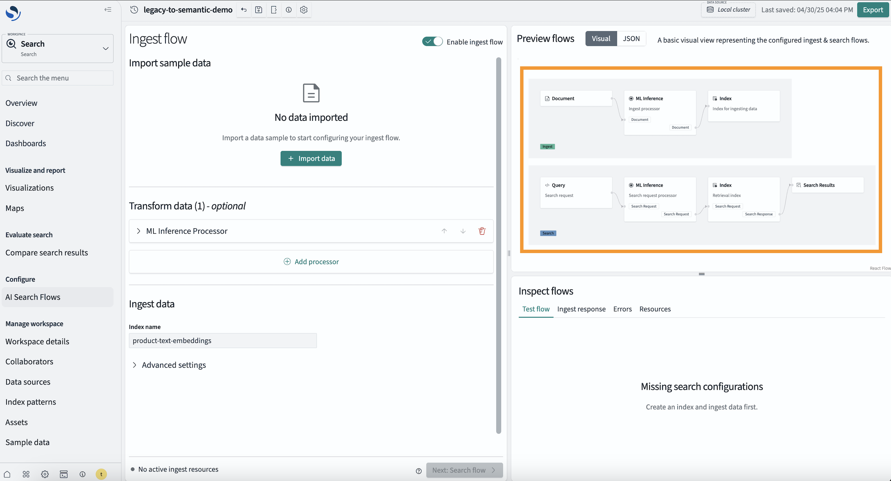
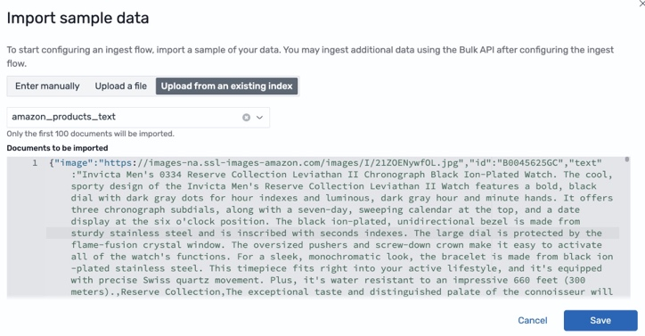
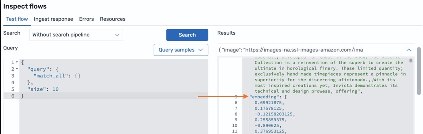
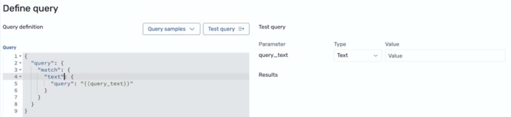
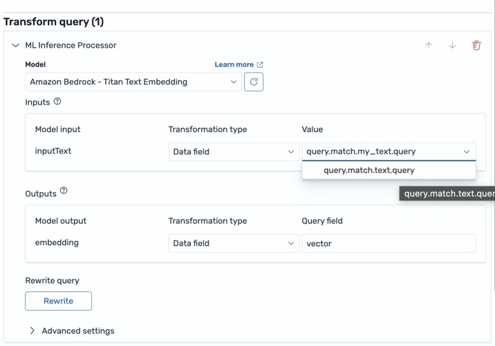
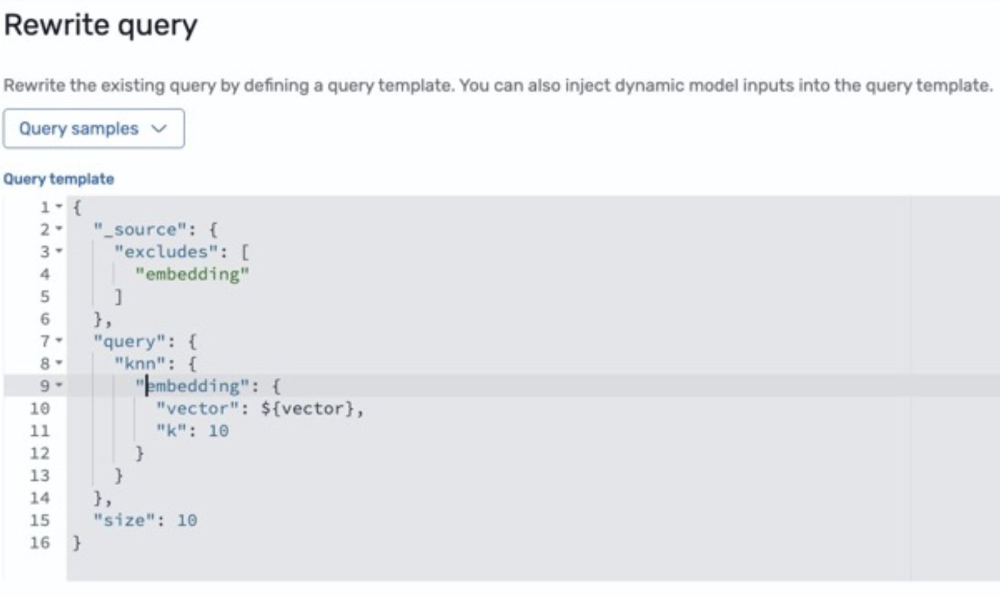
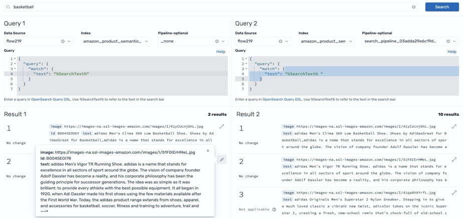
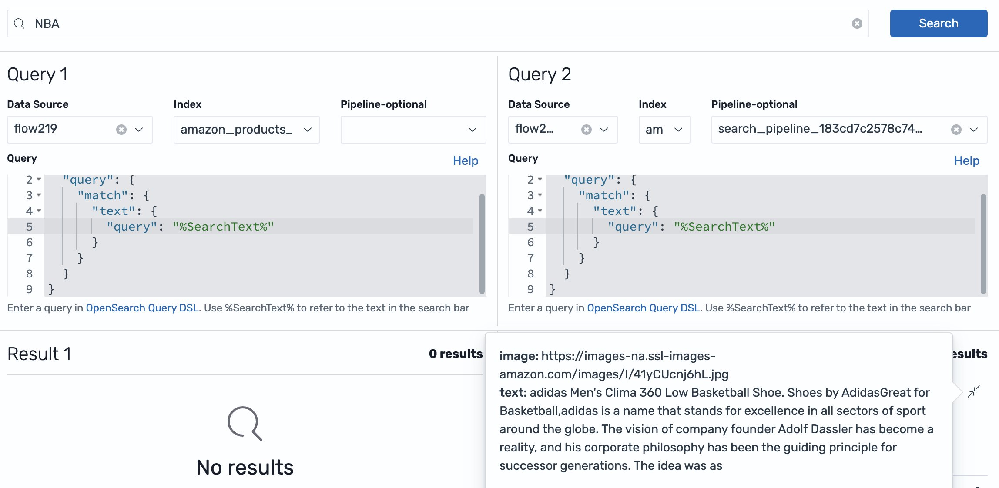
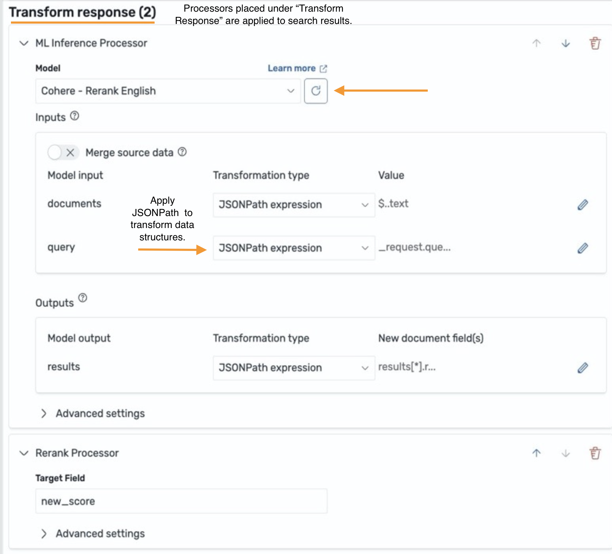
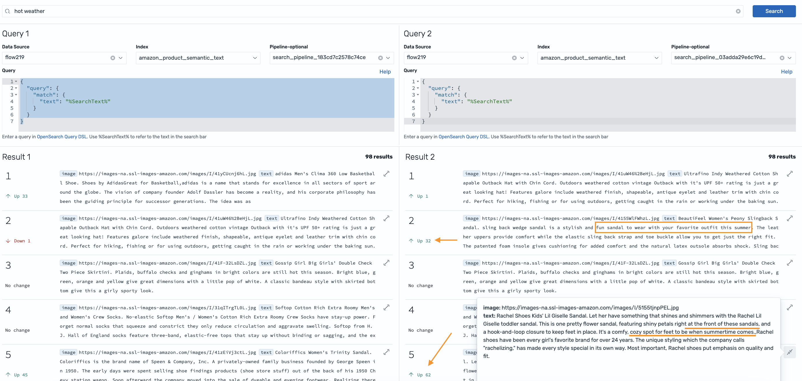

## 📝 Template bài dịch

# Amazon OpenSearch Service Ra Mắt Flow Builder Để Thúc Đẩy Đổi Mới Tìm Kiếm AI Nhanh Chóng

> **📖 Bài viết gốc**: Amazon OpenSearch Service launches flow builder to empower rapid AI search innovation 
> **👤 Tác giả**: Dylan Tong, Ka Ming Leung, Mingshi Liu, và Tyler Ohlsen 
> **📅 Ngày xuất bản**: 02 tháng 5 năm 2025 
> **🌐 Nguồn**: AWS Big Data Blog 
> **👨‍💻 Người dịch**: La Hoàng Tiến - FCJ Intern  
> **📅 Ngày dịch**: 01 tháng 07 năm 2025  
> **⏱️ Thời gian đọc**: 15-20 phút

---

## 📋 Tóm tắt

 Amazon OpenSearch Service đã ra mắt AI Search Flow Builder, một công cụ trực quan cho phép các nhà phát triển thiết kế và triển khai các luồng tìm kiếm AI mà 
 không cần xây dựng middleware tùy chỉnh phức tạp. Flow Builder hỗ trợ hai loại luồng chính: luồng nhập (ingest flows) để làm phong phú dữ liệu khi lập chỉ mục, 
 và luồng tìm kiếm (search flows) để xử lý động các yêu cầu và kết quả tìm kiếm. Công cụ này tích hợp với các dịch vụ AI như Amazon Bedrock, SageMaker, OpenAI, 
 và Cohere, cho phép xuất và triển khai luồng trên bất kỳ cụm OpenSearch 2.19+ nào. Bài viết trình bày hai tình huống thực tế: nâng cấp hệ thống tìm kiếm từ khóa 
 cũ thành tìm kiếm ngữ nghĩa mà không cần thay đổi mã client, và xây dựng hệ thống tìm kiếm hình ảnh đa phương thức sử dụng AI tạo sinh.

**🎯 Đối tượng đọc**: Nhà phát triển phần mềm, Kiến trúc sư giải pháp, Chuyên gia AI/ML  
**📊 Độ khó**: Intermediate/Advanced  
**🏷️ Tags**: OpenSearch, AI Search, Machine Learning, Vector Search, RAG, Semantic Search

---

## 📚 Mục lục

- [Giới thiệu](#phần-1-giới-thiệu)
- [Các Khái Niệm Chính Của AI Search Flow Builder](#phần-2-kiến-trúc-hệ-thống)
- [Tình Huống 1: Kích Hoạt Tìm Kiếm Ngữ Nghĩa Trên Ứng Dụng OpenSearch Mà Không Thay Đổi Mã Phía Client](#phần-3-implementation)
- [Tình Huống 2: Sử Dụng AI Tạo Sinh Để Tái Định Nghĩa Và Nâng Cao Tìm Kiếm Hình Ảnh](#phần-3-implementation)
- [Kết luận](#kết-luận)
- [Glossary - Thuật ngữ](#glossary---thuật-ngữ)
- [Tài liệu tham khảo](#tài-liệu-tham-khảo)

---

## Giới Thiệu
Giờ đây bạn có thể truy cập AI search flow builder trên các domain OpenSearch 2.19+ với **Amazon OpenSearch Service** và bắt đầu đổi mới các ứng dụng tìm kiếm AI nhanh hơn.
Thông qua một trình thiết kế trực quan, bạn có thể cấu hình các luồng tìm kiếm AI tùy chỉnh—một chuỗi các cải tiến dữ liệu được điều khiển bởi AI được thực hiện trong 
quá trình nhập và tìm kiếm. Bạn có thể xây dựng và chạy các luồng tìm kiếm AI này trên OpenSearch để cung cấp năng lượng cho các ứng dụng tìm kiếm AI trên OpenSearch mà 
không cần phải xây dựng và duy trì middleware tùy chỉnh.

Các ứng dụng ngày càng sử dụng AI và tìm kiếm để tái tạo và cải thiện tương tác người dùng, khám phá nội dung, và tự động hóa để nâng cao kết quả kinh doanh. Những đổi mới 
này chạy các luồng tìm kiếm AI để khám phá thông tin liên quan thông qua hiểu biết ngữ nghĩa, đa ngôn ngữ và nội dung; điều chỉnh xếp hạng thông tin theo hành vi cá nhân; 
và cho phép các cuộc trò chuyện có hướng dẫn để xác định chính xác câu trả lời. Tuy nhiên, các công cụ tìm kiếm bị hạn chế trong việc hỗ trợ tìm kiếm được cải tiến bởi AI 
nguyên bản, vì vậy các nhà phát triển phát triển middleware để bổ sung cho các công cụ tìm kiếm nhằm lấp đầy các khoảng trống chức năng. Middleware này bao gồm mã tùy chỉnh 
chạy các luồng dữ liệu để kết nối các biến đổi dữ liệu, truy vấn tìm kiếm và cải tiến AI trong các kết hợp khác nhau được điều chỉnh theo các trường hợp sử dụng, bộ dữ liệu 
và yêu cầu.

Với AI search flow builder mới cho OpenSearch, bạn có một môi trường cộng tác để thiết kế và chạy các luồng tìm kiếm AI trên OpenSearch. Bạn có thể tìm thấy trình thiết kế 
trực quan trong OpenSearch Dashboards dưới **AI Search Flows**, và bắt đầu nhanh chóng bằng cách khởi chạy các mẫu luồng được cấu hình sẵn cho các trường hợp sử dụng phổ biến 
như tìm kiếm ngữ nghĩa, đa phương thức hoặc lai, và tạo ra được tăng cường bằng truy xuất (RAG). Thông qua các cấu hình, bạn có thể tạo các luồng tùy chỉnh để làm phong phú 
các quy trình tìm kiếm và chỉ mục thông qua các nhà cung cấp AI như Amazon Bedrock, Amazon SageMaker, Amazon Comprehend, OpenAI, DeepSeek và Cohere. Các luồng có thể được xuất, 
triển khai và mở rộng theo chương trình trên bất kỳ cụm OpenSearch 2.19+ nào thông qua các API nhập, chỉ mục, quy trình làm việc và tìm kiếm hiện có của OpenSearch.

Trong phần còn lại của bài viết, chúng tôi sẽ hướng dẫn qua một vài tình huống để minh họa flow builder. Đầu tiên, chúng tôi sẽ kích hoạt tìm kiếm ngữ nghĩa trên ứng dụng 
OpenSearch dựa trên từ khóa cũ của bạn mà không cần thay đổi mã phía client. Tiếp theo, chúng tôi sẽ tạo một luồng RAG đa phương thức, để thể hiện cách bạn có thể tái định 
nghĩa khám phá hình ảnh trong các ứng dụng của mình.

## Các Khái Niệm Chính Của AI Search Flow Builder
Trước khi chúng ta bắt đầu, hãy đề cập đến một số khái niệm chính. Bạn có thể sử dụng flow builder thông qua API hoặc trình thiết kế trực quan. Trình thiết kế trực quan 
được khuyến nghị để giúp bạn quản lý các dự án quy trình làm việc. Mỗi dự án chứa ít nhất một luồng nhập hoặc tìm kiếm. Các luồng là một pipeline của các tài nguyên xử lý. 
Mỗi bộ xử lý áp dụng một loại biến đổi dữ liệu như mã hóa văn bản thành vector embeddings, hoặc tóm tắt kết quả tìm kiếm với dịch vụ AI chatbot.

Các luồng nhập được tạo để làm phong phú dữ liệu khi nó được thêm vào một chỉ mục. Chúng bao gồm:
1. Một mẫu dữ liệu của các tài liệu bạn muốn lập chỉ mục.
2. Một pipeline của các bộ xử lý áp dụng các biến đổi trên các tài liệu được nhập.
3. Một chỉ mục được xây dựng từ các tài liệu đã được xử lý.

Các luồng tìm kiếm được tạo để làm phong phú động yêu cầu tìm kiếm và kết quả. Chúng bao gồm:
1. Một giao diện truy vấn dựa trên **search API**, xác định cách luồng được truy vấn và chạy.
2. Một pipeline của các bộ xử lý biến đổi ngữ cảnh yêu cầu hoặc kết quả tìm kiếm.

Nói chung, con đường từ nguyên mẫu đến sản xuất bắt đầu với việc triển khai các **AI connectors** của bạn, thiết kế các luồng từ một mẫu dữ liệu, sau đó xuất các luồng của bạn 
từ một cụm phát triển đến môi trường tiền sản xuất để thử nghiệm ở quy mô lớn.

## Tình Huống 1: Kích Hoạt Tìm Kiếm Ngữ Nghĩa Trên Ứng Dụng OpenSearch Mà Không Thay Đổi Mã Phía Client
Trong tình huống này, chúng ta có một danh mục sản phẩm được xây dựng trên OpenSearch một thập kỷ trước. Chúng ta nhằm cải thiện chất lượng tìm kiếm của nó, và do đó, nâng cao 
việc mua hàng. Danh mục có các vấn đề về chất lượng tìm kiếm, ví dụ, một tìm kiếm cho "NBA," không hiển thị hàng hóa bóng rổ. Ứng dụng cũng không được chạm đến trong một thập kỷ, 
vì vậy chúng ta nhằm tránh các thay đổi đối với mã phía client để giảm rủi ro và nỗ lực thực hiện.

Một giải pháp yêu cầu những điều sau:
• Một **ingest flow để** tạo text embeddings (vectors) từ văn bản trong một chỉ mục hiện có.
• Một **search flow** mã hóa các thuật ngữ tìm kiếm thành text embeddings, và viết lại động các truy vấn kiểu match từ khóa thành một **k-NN (vector)** query để chạy tìm kiếm ngữ 
nghĩa trên các thuật ngữ được mã hóa. Việc viết lại cho phép ứng dụng của bạn chạy minh bạch các truy vấn kiểu ngữ nghĩa thông qua các truy vấn kiểu từ khóa.

Chúng ta cũng sẽ đánh giá một luồng xếp hạng lại giai đoạn thứ hai, sử dụng cross-encoder để xếp hạng lại kết quả vì nó có thể tăng cường chất lượng tìm kiếm.

Chúng ta sẽ hoàn thành nhiệm vụ của mình thông qua flow builder. Chúng ta bắt đầu bằng cách điều hướng đến **AI Search Flows** trong **OpenSearch Dashboard**, 
và chọn **Semantic Search** từ danh mục mẫu.

Mẫu này yêu cầu chúng ta chọn một mô hình text embedding. Chúng ta sẽ sử dụng Amazon Bedrock Titan Text, đã được triển khai như một điều kiện tiên quyết. Khi mẫu được cấu hình, 
chúng ta vào giao diện chính của trình thiết kế. Từ bản xem trước, chúng ta có thể thấy rằng mẫu bao gồm một luồng nhập và tìm kiếm được đặt trước.

Luồng nhập yêu cầu chúng ta cung cấp một mẫu dữ liệu. Danh mục sản phẩm của chúng ta hiện đang được phục vụ bởi một chỉ mục chứa **bộ dữ liệu sản phẩm Amazon**, vì vậy chúng ta nhập
một mẫu dữ liệu từ chỉ mục này.

Luồng nhập bao gồm một **ML Inference Ingest Processor**, tạo ra các đầu ra mô hình học máy (ML) như embeddings (vectors) khi dữ liệu của bạn được nhập vào OpenSearch. Như đã cấu 
hình trước đó, bộ xử lý được đặt để sử dụng Amazon Titan Text để tạo text embeddings. Chúng ta ánh xạ trường dữ liệu chứa mô tả sản phẩm của chúng ta đến trường inputText của 
mô hình để kích hoạt tạo embedding.

Bây giờ chúng ta có thể chạy luồng nhập của mình, xây dựng một chỉ mục mới chứa các embeddings mẫu dữ liệu của chúng ta. Chúng ta có thể kiểm tra nội dung của chỉ mục để xác nhận 
rằng các embeddings đã được tạo thành công.

Khi chúng ta có một chỉ mục, chúng ta có thể cấu hình luồng tìm kiếm của mình. Chúng ta sẽ bắt đầu với việc cập nhật giao diện truy vấn, được đặt trước thành một truy vấn match 
cơ bản. Placeholder **my_text** phải được thay thế bằng mô tả sản phẩm. Với bản cập nhật này, luồng tìm kiếm của chúng ta giờ đây có thể phản hồi các truy vấn từ ứng dụng 
kế thừa của chúng ta.

Luồng tìm kiếm bao gồm một **ML Inference Search Processor**. Như đã cấu hình trước đó, nó được đặt để sử dụng Amazon Titan Text. Vì nó được thêm dưới Transform query, nó được 
áp dụng cho các yêu cầu truy vấn. Trong trường hợp này, nó sẽ biến đổi các thuật ngữ tìm kiếm thành text embeddings (một query vector). Trình thiết kế liệt kê các biến từ giao 
diện truy vấn, cho phép chúng ta ánh xạ các thuật ngữ tìm kiếm **(query.match.text.query)**, đến trường inputText của mô hình. Text embeddings giờ đây sẽ được tạo từ các thuật ngữ 
tìm kiếm bất cứ khi nào chỉ mục của chúng ta được truy vấn.

Tiếp theo, chúng ta cập nhật các cấu hình viết lại truy vấn, được đặt trước để viết lại truy vấn match thành một truy vấn k-NN. Chúng ta thay thế placeholder **my_embedding** bằng 
trường truy vấn được gán cho embeddings của bạn. Lưu ý rằng chúng ta có thể viết lại điều này thành một loại truy vấn khác, bao gồm một **hybrid query**, có thể cải thiện chất 
lượng tìm kiếm.

Hãy so sánh các giải pháp ngữ nghĩa và từ khóa của chúng ta từ **công cụ so sánh tìm kiếm**. Cả hai giải pháp đều có thể tìm thấy hàng hóa bóng rổ khi chúng ta tìm kiếm "basketball."

Nhưng điều gì xảy ra nếu chúng ta tìm kiếm "NBA?" Chỉ có luồng tìm kiếm ngữ nghĩa của chúng ta trả về kết quả vì nó phát hiện sự tương đồng ngữ nghĩa giữa "NBA" và "basketball."

Chúng ta đã quản lý các cải tiến, nhưng chúng ta có thể làm tốt hơn. Hãy xem liệu việc xếp hạng lại kết quả tìm kiếm của chúng ta với cross-encoder có giúp ích không. Chúng ta 
sẽ thêm một **ML Inference Search Processor** dưới **Transform response**, để bộ xử lý áp dụng cho kết quả tìm kiếm, và chọn Cohere Rerank. Từ trình thiết kế, chúng ta thấy rằng 
**Cohere Rerank** yêu cầu một danh sách tài liệu và ngữ cảnh truy vấn làm đầu vào. Các biến đổi dữ liệu cần thiết để đóng gói kết quả tìm kiếm thành một định dạng có thể được xử lý bởi 
**Cohere Rerank**. Vì vậy, chúng ta áp dụng các biểu thức JSONPath để trích xuất ngữ cảnh truy vấn, làm phẳng cấu trúc dữ liệu, và đóng gói mô tả sản phẩm từ tài liệu của chúng 
ta thành một danh sách.

Hãy quay lại công cụ so sánh tìm kiếm để so sánh các biến thể luồng của chúng ta. Chúng ta không quan sát thấy bất kỳ sự khác biệt có ý nghĩa nào trong tìm kiếm trước đó của 
chúng ta cho "basketball" và "NBA." Tuy nhiên, các cải tiến được quan sát khi chúng ta tìm kiếm, "hot weather." Ở bên phải, chúng ta thấy rằng kết quả tìm kiếm thứ hai và thứ 
năm đã di chuyển lên 32 và 62 vị trí, và trả về "sandals" rất phù hợp cho "hot weather."

Chúng ta đã sẵn sàng tiến hành sản xuất, vì vậy chúng ta **export** các luồng của mình từ cụm phát triển của chúng ta vào môi trường tiền sản xuất của chúng ta, sử dụng các 
API quy trình làm việc để tích hợp các luồng của chúng ta vào tự động hóa, và mở rộng các quy trình thử nghiệm của chúng ta thông qua các API bulk, ingest và search.

## Tình Huống 2: Sử Dụng AI Tạo Sinh Để Tái Định Nghĩa Và Nâng Cao Tìm Kiếm Hình Ảnh
Trong tình huống này, chúng ta có hình ảnh của hàng triệu thiết kế thời trang. Chúng ta đang tìm kiếm một giải pháp tìm kiếm hình ảnh ít bảo trì. Chúng ta sẽ sử dụng AI đa 
phương thức tạo sinh để hiện đại hóa tìm kiếm hình ảnh, loại bỏ nhu cầu lao động để duy trì thẻ hình ảnh và siêu dữ liệu khác.

Giải pháp của chúng ta yêu cầu những điều sau:
• Một **ingest flow** sử dụng một mô hình đa phương thức như Amazon Titan Multimodal Embeddings G1 để tạo image embeddings.
• Một **search flow** tạo text embeddings với một mô hình đa phương thức, chạy một truy vấn k-NN để khớp văn bản với hình ảnh, và gửi các hình ảnh khớp đến một mô hình tạo sinh 
như Anthropic's Claude Sonnet 3.7 có thể hoạt động trên văn bản và hình ảnh.

Chúng ta sẽ bắt đầu từ mẫu **RAG with Vector Retrieval**. Với mẫu này, chúng ta có thể nhanh chóng cấu hình một luồng RAG cơ bản. Mẫu yêu cầu một embedding và mô hình ngôn ngữ lớn 
(LLM) có thể xử lý nội dung văn bản và hình ảnh. Chúng ta sử dụng Amazon Bedrock Titan Multimodal G1 và Anthropic's Claude Sonnet 3.7, tương ứng.

Từ bảng xem trước của trình thiết kế, chúng ta có thể thấy sự tương đồng giữa mẫu này và mẫu tìm kiếm ngữ nghĩa. Một lần nữa, chúng ta gieo hạt luồng nhập với một mẫu dữ liệu. 
Giống như ví dụ trước, chúng ta sử dụng bộ dữ liệu sản phẩm Amazon ngoại trừ chúng ta thay thế mô tả sản xuất bằng hình ảnh được mã hóa base64 vì các mô hình của chúng ta yêu cầu 
hình ảnh base64, và giải pháp này không yêu cầu văn bản. Chúng ta ánh xạ dữ liệu hình ảnh base64 đến các đầu vào Amazon Titan G1 tương ứng để tạo embeddings. Sau đó chúng ta chạy 
luồng nhập của mình và xác nhận rằng chỉ mục của chúng ta chứa hình ảnh base64 và các embeddings tương ứng.

Các bước ban đầu để cấu hình luồng tìm kiếm này tương tự như tình huống trước: chúng ta cập nhật giao diện truy vấn, ánh xạ các trường văn bản truy vấn đến các đầu vào mô hình cho 
ML Inference Search Processor, và sửa đổi cài đặt viết lại truy vấn. Sự khác biệt chính với luồng này là bộ xử lý phản hồi bổ sung được đặt để sử dụng Anthropic's Claude Sonnet 3.7
để xử lý hình ảnh.

Chúng ta cần cấu hình một prompt LLM bao gồm ngữ cảnh truy vấn và hướng dẫn cho LLM đóng vai trò của một cố vấn thời trang, và cung cấp bình luận về payload hình ảnh.

Tiếp theo, chúng ta ánh xạ prompt và trường dữ liệu hình ảnh base64 đến các đầu vào của mô hình tương ứng.

Hãy thử nghiệm luồng RAG đa phương thức của chúng ta bằng cách tìm kiếm "sunset colored dresses." Chúng ta quan sát các kết quả sau.

Chiếc váy xinh đẹp này hoàn hảo thể hiện tinh túy của hoàng hôn với hiệu ứng chuyển màu ombre tuyệt đẹp. Bắt đầu với mà
màu hồng đào nhẹ nhàng ở phần trên, chuyển sang màu cam rực rỡ ở giữa, và kết thúc bằng màu vàng tươi ở viền váy – giống hệt như những màu sắc của bầu trời khi mặt trời lặn xuống 
đường chân trời. Chiếc váy có thiết kế đơn giản, thoải mái với tay áo ngắn và có vẻ như có form dáng thoải mái, rộng rãi phù hợp với nhiều dáng người. Hiệu ứng nhuộm tie-dye mang đến
phong cách bohemian, tự do hoàn hảo cho những chuyến đi mùa hè, kỳ nghỉ biển, hoặc các sự kiện tối giản thường. Tôi khuyên bạn nên chọn chiếc váy màu hoàng hôn này vì nó bắt mắt, 
đa năng, và thể hiện ánh sáng hoàng hôn kỳ diệu có thể làm sáng bừng bất kỳ dịp nào. Những màu sắc này sẽ đặc biệt phù hợp với tông da ấm, và bạn có thể dễ dàng trang trọng hóa với
phụ kiện vàng hoặc giữ phong cách giản dị với đôi sandal đơn giản.

Chiếc váy tie-dye rực rỡ này hoàn hảo thể hiện tinh túy của hoàng hôn với dải màu chuyển sắc tuyệt đẹp. Chiếc váy có những dải màu vàng óng, cam rực lửa, và hồng đậm hòa quyện với 
nhau một cách mượt mà, gợi nhớ đến bầu trời lúc chạng vạng.Thiết kế không dây tôn lên đôi vai một cách thanh lịch, trong khi phần eo thắt tạo nên đường cong quyến rũ chảy xuống
thành chân váy thoải mái dài đến đầu gối. Chiếc váy này sẽ là lựa chọn tuyệt vời cho các sự kiện mùa hè, kỳ nghỉ biển,hoặc những chuyến đi thường ngày. Bảng màu hoàng hôn không 
chỉ hợp xu hướng mà còn đủ linh hoạt để kết hợp với các phụkiện màu trung tính. Tôi khuyên bạn nên chọn món đồ này vì những màu sắc bắt mắt, form dáng thoải mái, và cách nó thể 
hiện cảm giác ấm áp, thư giãn khi ngắm nhìn hoàng hôn tuyệt đẹp.

Không có bất kỳ siêu dữ liệu hình ảnh nào, OpenSearch tìm thấy hình ảnh của những chiếc váy màu hoàng hôn, và phản hồi với bình luận chính xác và đầy màu sắc.

## Kết Luận
AI search flow builder có sẵn trong tất cả các AWS Regions hỗ trợ OpenSearch 2.19+ trên OpenSearch Service. Để tìm hiểu thêm, tham khảo Building AI search workflows in OpenSearch Dashboards, 
và các hướng dẫn có sẵn trên GitHub, minh họa cách tích hợp các mô hình AI khác nhau từ Amazon Bedrock, SageMaker, và các dịch vụ AI AWS và bên thứ ba khác.
---
## 👨 Về Các Tác Giả

Dylan Tong là Senior Product Manager tại Amazon Web Services. Anh ấy dẫn dắt các sáng kiến sản phẩm cho AI và machine learning (ML) trên OpenSearch bao gồm khả năng cơ sở dữ liệu 
vector của OpenSearch. Dylan có nhiều thập kỷ kinh nghiệm làm việc trực tiếp với khách hàng và tạo ra các sản phẩm và giải pháp trong lĩnh vực cơ sở dữ liệu, phân tích và AI/ML. 
Dylan có bằng BSc và MEng về Khoa học Máy tính từ Đại học Cornell.

Tyler Ohlsen là một kỹ sư phần mềm tại Amazon Web Services tập trung chủ yếu vào các plugin OpenSearch Anomaly Detection và Flow Framework.

Mingshi Liu là một Kỹ sư Machine Learning tại OpenSearch, chủ yếu đóng góp cho OpenSearch, ML Commons và Search Processors repo. Công việc của cô tập trung vào việc phát triển và 
tích hợp các tính năng machine learning cho công nghệ tìm kiếm và các dự án mã nguồn mở khác.

Ka Ming Leung (Ming) là một Senior UX designer tại OpenSearch, tập trung vào trải nghiệm nhà phát triển tìm kiếm được hỗ trợ bởi ML cũng như thiết kế các tính năng quan sát và quản lý cụm.

## 📖 Glossary - Thuật ngữ

| English | Tiếng Việt | Định nghĩa |
|---------|------------|------------|
| AI Search Flow Builder  | Trình xây dựng luồng tìm kiếm AI | Công cụ trực quan để thiết kế và triển khai các luồng tìm kiếm AI |
| Pipeline | Quy trình | Pipeline có thể là một chuỗi các bước như trích xuất dữ liệu, tiền xử lý, huấn luyện mô hình, và triển khai mô hình |
| Ingest Flow  | Luồng nhập | Pipeline xử lý dữ liệu khi được thêm vào chỉ mục |
| Search Flow | Luồng tìm kiếm | Pipeline xử lý yêu cầu tìm kiếm và kết quả |
| Semantic Search | Tìm kiếm ngữ nghĩa | Tìm kiếm dựa trên ý nghĩa thay vì từ khóa chính xác |
| Text Embeddings | Mã hóa văn bản | Biểu diễn vector của văn bản để tính toán tương đồng |
| RAG (Retrieval Augmented Generation) | Tạo sinh tăng cường bằng truy xuất | Kỹ thuật kết hợp tìm kiếm và AI tạo sinh |
| Cross-encoder | Bộ mã hóa chéo | Mô hình AI để xếp hạng lại kết quả tìm kiếm |
| Multimodal  | Đa phương thức | Xử lý nhiều loại dữ liệu (văn bản, hình ảnh, âm thanh) |
| k-NN Query | Truy vấn k láng giềng gần nhất | Thuật toán tìm kiếm vector tương đồng |
| ML Inference Processor | Bộ xử lý suy luận ML | Component thực hiện các tác vụ machine learning trong pipeline |
| Vector Database | Cơ sở dữ liệu vector | Database được tối ưu hóa để lưu trữ và tìm kiếm vector embeddings |
| Middleware  | Phần mềm trung gian | Software layer kết nối các components khác nhau trong hệ thống |
| Placeholder  | Trình giữ chỗ | Một yếu tố tạm thời, một chỗ trống hoặc một giá trị mẫu được đặt vào một vị trí cụ thể. |

## 🔗 Tài liệu tham khảo

### Tài liệu gốc
- [Original Article](https://aws.amazon.com/vi/blogs/big-data/amazon-opensearch-service-launches-flow-builder-to-empower-rapid-ai-search-innovation/): Bài viết gốc
- [OpenSearch Documentation](https://opensearch.org/docs/): Tài liệu chính thức OpenSearch
- [Amazon Bedrock](https://aws.amazon.com/bedrock/): Dịch vụ AI foundation models

### Tài liệu tiếng Việt
- [AWS Documentation VN](https://aws.amazon.com/vi/what-is/opensearch/): Tài liệu AWS tiếng Việt
- [Community Discussions](https://www.facebook.com/groups/660548818043427): Cộng đồng AWS VN
- [AWS Learning Resources](https://cloudjourney.awsstudygroup.com): Tài nguyên học tập AWS

### Tools và Services
- [Amazon OpenSearch Service](https://aws.amazon.com/opensearch-service/): Managed OpenSearch service
- [Amazon Bedrock](https://aws.amazon.com/bedrock/): Foundation models service
- [Amazon SageMaker](https://aws.amazon.com/sagemaker/): Machine learning platform
- [Cohere](https://cohere.ai/): AI platform for enterprise
- [OpenAI](https://openai.com/): AI research and deployment company
---

## 💬 Ghi chú của người dịch

Bài viết này là một technical blog post chuyên sâu về AI Search Flow Builder - tính năng mới của Amazon OpenSearch Service được công bố ngày 02/05/2025. 
Quá trình dịch từ bài gốc tiếng Anh sang tiếng Việt đòi hỏi sự cân bằng tinh tế giữa độ chính xác kỹ thuật và khả năng tiếp cận của độc giả Việt Nam.

### Challenges trong quá trình dịch
- **Technical Terms**: 
    "Flow builder" → Giữ nguyên + bổ sung "Trình xây dựng luồng" để đảm bảo tính nhất quán
    "Semantic search" vs "keyword search" → Cần giải thích rõ sự khác biệt: "tìm kiếm ngữ nghĩa" vs "tìm kiếm từ khóa"
    "RAG" → Giữ viết tắt + dịch đầy đủ "Tạo sinh tăng cường bằng truy xuất"
    "Middleware" → "Phần mềm trung gian" với context cụ thể về vai trò trong architecture
- **Cultural Context**: 
    Business context: Giải thích rõ hơn về "legacy application" và "client-side code changes"
- **Complex Concepts**:
    Multimodal AI: "AI đa phương thức" với giải thích cụ thể về xử lý text + image
    Pipeline: "Giữ nguyên" với giải thích cụ thể
### Insights gained
- **Technical Learning**:
    OpenSearch Architecture: Hiểu sâu về cách tích hợp AI services với OpenSearch
    AI Models Integration: Nắm được cách sử dụng Titan Text, Claude Sonnet 3.7, Cohere Rerank
    Search Quality Optimization: Hiểu về semantic search, hybrid search, và reranking techniques
- **Language Skills**:
    Technical Translation: Phát triển khả năng dịch technical documentation chính xác
    Concept Explanation: Cải thiện kỹ năng giải thích khái niệm AI/ML bằng tiếng Việt
    Cultural Adaptation: Rèn luyện kỹ năng adapt technical content cho context VN
- **Industry Knowledge**:
    AI Search Evolution: Hiểu xu hướng transformation từ keyword search sang AI-powered search
    Legacy System Modernization: Nắm được challenges khi upgrade hệ thống cũ
    Business Impact: Hiểu business value của AI search implementation

---

## 🤝 Đóng góp và Feedback

Bài dịch này được thực hiện trong khuôn khổ **FCJ Internship Program**. 

**📧 Liên hệ**:  lahoangtien1418@gmail.com
**💬 Feedback**: Mọi góp ý để cải thiện chất lượng dịch thuật xin gửi về email trên  
**🔄 Updates**: Bài dịch sẽ được cập nhật dựa trên feedback từ cộng đồng
**© 2025 - Bản dịch thuộc về La Hoàng Tiến. Vui lòng credit khi sử dđồng**
---